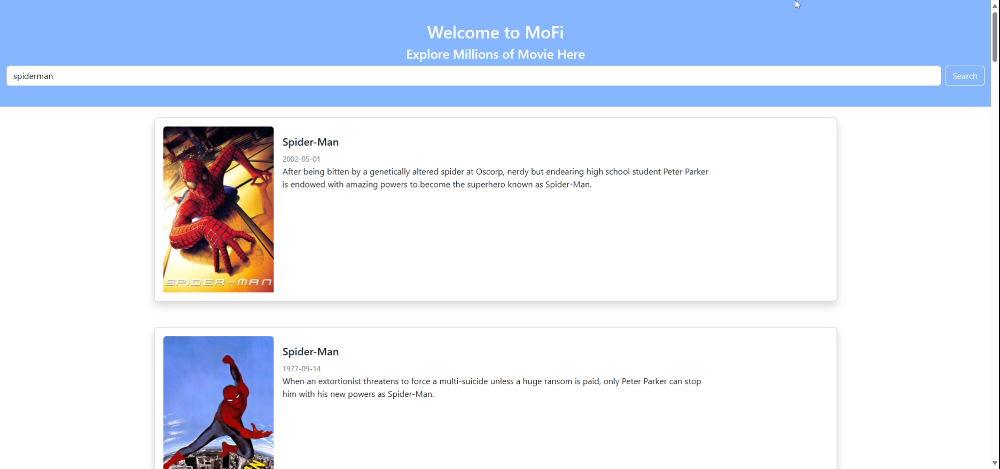
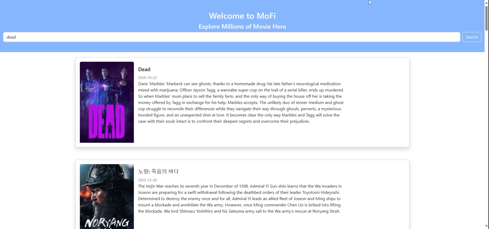

<h1 align="center">
Mofi_Explore Millions of Movie
</h1>

Project to Create Web Applications with ES6, Custom Element, NPM, Webpack, AJAX, also using the movie db API

<h2 align="center">
Preview Web
</h2>

  
  <!-- &#8287;&#8287;&#8287;&#8287;&#8287; -->
  

  <!--  -->
  <!-- &#8287;&#8287;&#8287;&#8287;&#8287; -->
  <!--  -->

<h2 align="center">
Presented By
</h2>
<h3 align="center">Rafi Rachmad Ramadhan</h3>
 
